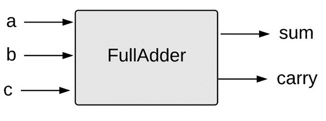

# Boolean Arithmetic and the ALU

## Binary Numbers

When in doubt visit:
[Binary Number System](https://www.mathsisfun.com/binary-number-system.html)

## Binary Additioin

Example:

|Carry |1|1|1|1|1| | | |Decimal|
|----- |-|-|-|-|-|-|-|-|-------|
|First |0|1|1|1|1|1|0|1|  125  |
|Second|0|0|1|1|0|1|1|0|  54   |
|Result|1|0|1|1|0|0|1|1|  179  |

## Negative Numbers

### Two's complement system

**I have derived a simple formula, but it is not tested much.**
The formula goes as follows:
If we want to use negative numbers in binary, and we use the `two's complement` convention, to get a n-bit binary representation of a number k we add that number in decimal  to $2^n$ and then convert the result to binary while ignoring the overflowing bits.

>Example:
To get -3 as a 4 bit binary number we do:
$ 2^4 + (-3) = 16 -3 = 13; (13)_2 = 1101 $
So (-3) in 4 bit binary is `1101`

| bin n=4| dec (k)| formula for $k_2=(2^n+k)_2$             |
|--------|--------|-----------------------------------------|
|    1000|  -8    | $ 2^4+(-8) = 16-8 =8 ; (8)_2=1000  $    |
|    1001|  -7    | $ 2^4+(-7) = 16-7 =9 ; (9)_2=1001  $    |
|    1010|  -6    | $ 2^4+(-6) = 16-6 =10; (10)_2=1010 $    |
|    1011|  -5    | $ 2^4+(-5) = 16-5 =11; (11)_2=1011 $    |
|    1100|  -4    | $ 2^4+(-4) = 16-4 =12; (12)_2=1100 $    |
|    1101|  -3    | $ 2^4+(-3) = 16-3 =13; (13)_2=1101 $    |
|    1110|  -2    | $ 2^4+(-2) = 16-2 =14; (14)_2=1110 $    |
|    1111|  -1    | $ 2^4+(-1) = 16-1 =15; (15)_2=1111 $    |
|    0000|   0    | $ 2^4+0 = 16+0 =16; (16)_2=10000^* $    |
|    0001|   1    | $ 2^4+1 = 16+1=17; (17)_2=10001^*  $    |
|    0010|   2    | $ 2^4+2 = 16+2=18; (18)_2=10010^*  $    |
|    0011|   3    | $ 2^4+3 = 16+3=19; (19)_2=10011^*  $    |
|    0100|   4    | $ 2^4+4 = 16+4=12; (20)_2=10100^*  $    |
|    0101|   5    | $ 2^4+5 = 16+5=21; (21)_2=10101^*  $    |
|    0110|   6    | $ 2^4+6 = 16+6=22; (22)_2=10110^*  $    |
|    0111|   7    | $ 2^4+7 = 16+7=23; (23)_2=10111^*  $    |

!!! NOTE *
    When we use the formula on the positive numbers, we produce a buffer overflow, so as usual, we disregard the 5th (msb) bit and we get the correct answer.

By using the `Two's complementary` convention we have working substraction by just adding the two binary numbers together.

Example - addition of a positive and negarive nmbers :

|Carry |1|1| | |Decimal|
|----- |-|-|-|-|-------|
|First |0|1|1|1|  7    |
|Second|1|1|1|0|  -2   |
|Result|0|1|0|1|  5    |

Example -  addition of two negative numbers:

|Carry |1|1| | |Decimal|
|----- |-|-|-|-|-------|
|First |1|0|1|0|  -6   |
|Second|1|1|1|1|  -1   |
|Result|1|0|0|1|   5   |

Example -  addition of two negative numbers with buffer overflow:

|Carry |1| | | |Decimal|
|----- |-|-|-|-|-------|
|First |1|0|1|0|  -6   |
|Second|1|0|0|1|  -7   |
|Result|0|0|1|1|   3   |

>*Hint: To convert from negative integer in binary to decimal
>$-(2^{n-1}) - v$
>where `n` is the bit width of the number (ex. 8 bit, 4 bit, etc.)
>and `v` is the decimal value of the magnitude bits of the number
>Example for 1011 (-5):
>n = 4; v = 3( the magnitude bits are to the left of the msb - 011 );
>so we have $-(2^{4-1}) - 3 = -8-3 = -5$*

## Building an adder

* Half adder: adds two bits
* Full adder: adds three bits
* Adder: adds two integers

### Half adder truth table

|a |b |sum | carry|
|--|--|----|------|
|0 |0 |0   |0     |
|0 |1 |1   |0     |
|1 |0 |1   |0     |
|1 |1 |0   |1     |

### Full adder

## The ALU - Arithmetic Logic Unit

*From Wikipedia:*
An arithmetic logic unit (ALU) is a combinational digital electronic circuit that performs arithmetic and bitwise operations on integer binary numbers. This is in contrast to a floating-point unit (FPU), which operates on floating point numbers. An ALU is a fundamental building block of many types of computing circuits, including the central processing unit (CPU) of computers, FPUs, and graphics processing units (GPUs). A single CPU, FPU or GPU may contain multiple ALUs.

### The HACK ALU

The ALU for the HACK computer that we well be building in the course looks as follows:

#### operands
x - input: 16 bit operand

y - input: 16 bit operand

#### presetting x
zx - input: if 1 then x=0 else x;

nx - input: if 1 then x=!x else x;

#### presetting y
zy - input: if 1 then y=0 else y;

ny - input: if 1 then y=!y else y;

#### function select
f  - input: if 1 then out = x+y else out=x&y

#### post-setting function output
no - input: if 1 then out=!out else out=out

#### output flags
zr - output flag: if 1 then the out is 0 else out out is non zero

ng - output flag: if 1 then the out is negative number else out is positive

