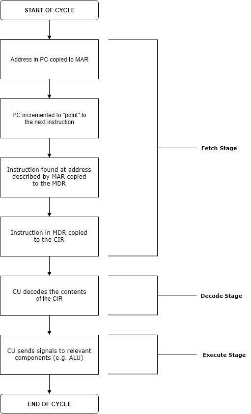

# Unit 5: Computer Architecture

## Von Newman Architecture

Von Neumann architecture was first published by John von Neumann in 1945.

His computer architecture design consists of a Control Unit, Arithmetic and Logic Unit (ALU), Memory Unit, Registers and Inputs/Outputs.

Von Neumann architecture is based on the stored-program computer concept, where instruction data and program data are stored in the same memory.  This design is still used in most computers produced today.

## The fetch-execute cycle

The [fetch execute cycle](https://www.computerscience.gcse.guru/glossary/fetch-execute-cycle) is the basic operation (instruction) cycle of a computer (also known as the fetch decode execute cycle).

During the fetch execute cycle, the computer retrieves a program instruction from its memory.  It then establishes and carries out the actions that are required for that instruction.

The cycle of fetching, decoding, and executing an instruction is continually repeated by the [CPU](https://www.computerscience.gcse.guru/glossary/central-processing-unit)whilst the computer is turned on.

### Steps:

1. The [PC](https://www.computerscience.gcse.guru/glossary/program-counter) contains the address of the memory location that has the next instruction which has to be fetched.

2. This address is then copied from the PC to the [MAR](https://www.computerscience.gcse.guru/glossary/memory-address-register)(Memory Address Register) via the [address bus](https://www.computerscience.gcse.guru/glossary/address-bus).

3. The value in the PC is then incremented by 1 so that it now points to the next instruction which has to be fetched

4. The contents (instruction) at the memory location (address) contained in MAR are then copied into the [MDR](https://www.computerscience.gcse.guru/glossary/memory-data-register)(Memory Data Register)

5. The contents (instruction) in the MDR is then copied and placed into the [CIR](https://www.computerscience.gcse.guru/glossary/current-instruction-register)(Current Instruction Register)

6. The instruction is finally decoded and then executed by sending out signals (via [control bus](https://www.computerscience.gcse.guru/glossary/control-bus)) to the various components of the computer

7. Repeat

